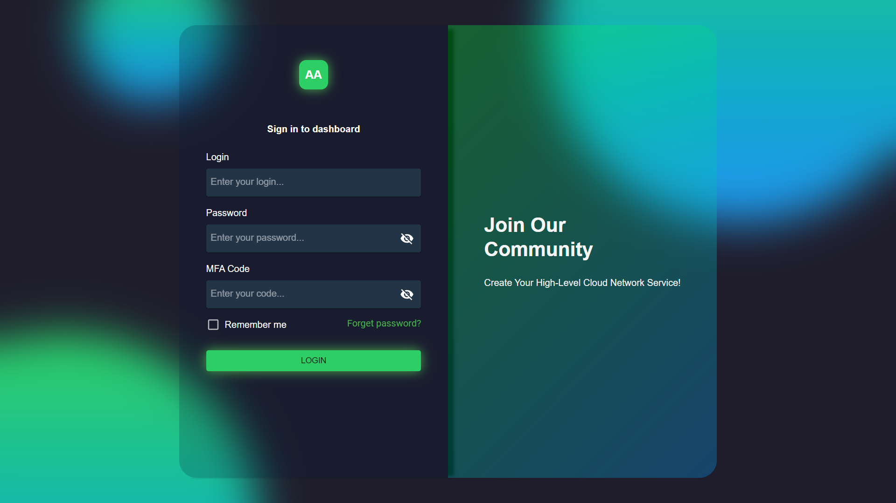
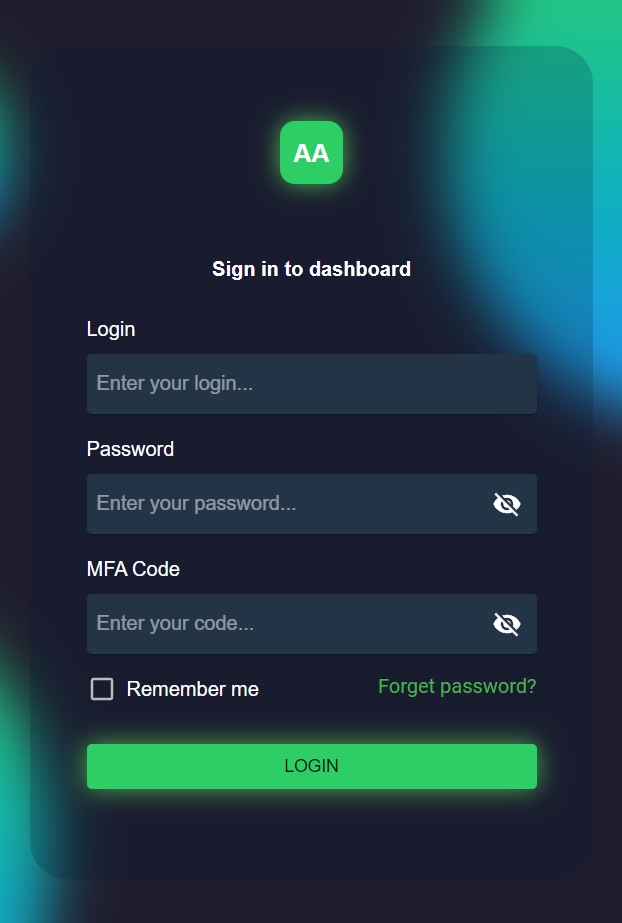

<h1 align='center' style="font-size:5rem"><b>Risponsive Glassmorphism Login Page</b></h1>

   
<h2 align='center'>
    Você pode usar esta página de login em seu projeto e personalizá-la para funcionar em sites reais.
</h2>

   

    <h2>Modo Desktop</h2>
    </img>

    <h2>Modo Mobile</h2>
    </img>

    

<h1 align='center'><b>Habilidades</b></h1>

<ul>
    <li>Isso é apenas uma interface de usuário, não espere nada além de beleza :)</li>
</ul>

    
<h1 align='center'><b>Linguagens e tecnologias usadas neste projeto</h1>

    

<h1 align='center'><b>Requisitos</b></h1>

Faça o download e instale o `NodeJS` no site oficial <a href="https://nodejs.org/">nodeJS.org</a>

    

<h1 align='center'><b>Como Executar</b></h1>

Primeiro, você precisa clonar o projeto e abri-lo em sua `IDE`

 

Abra o terminal da IDE e digite `~ npm i` para instalar as dependências

 

Em seguida, digite `~ npm start` e pressione Enter

Parabéns, agora você pode usar esta página em seu belo projeto.

Este trabalho foi realizado como parte do projeto da faculdade por Gustavo Girardi e Felipe Seganfredo, usando React com Next JS.
